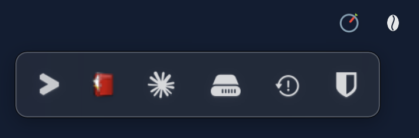
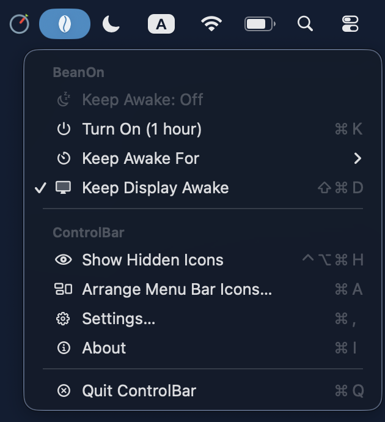
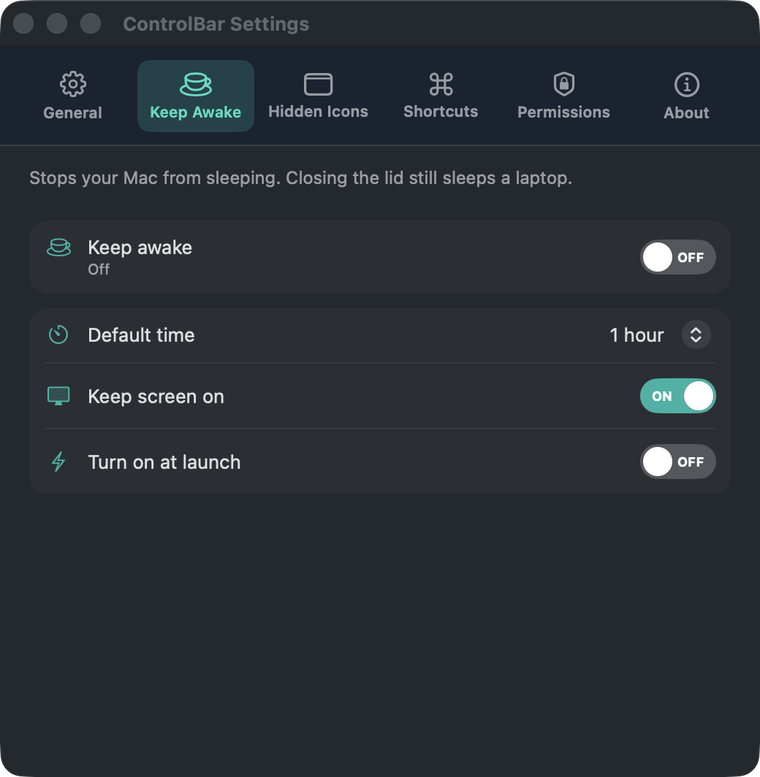
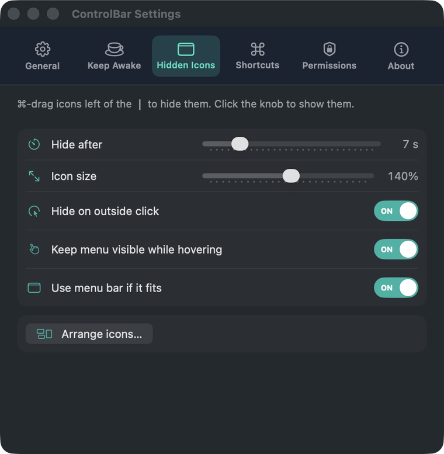
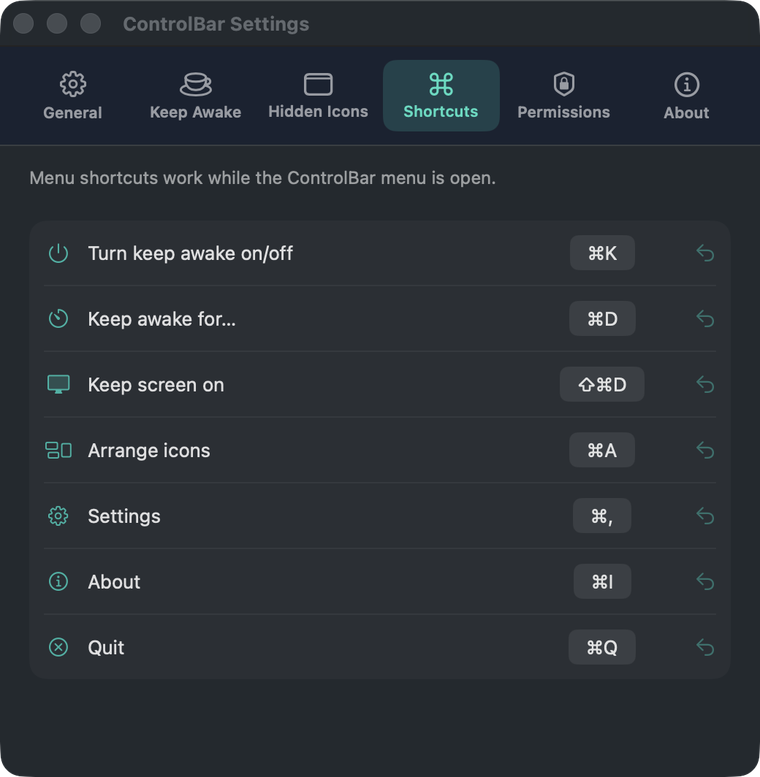
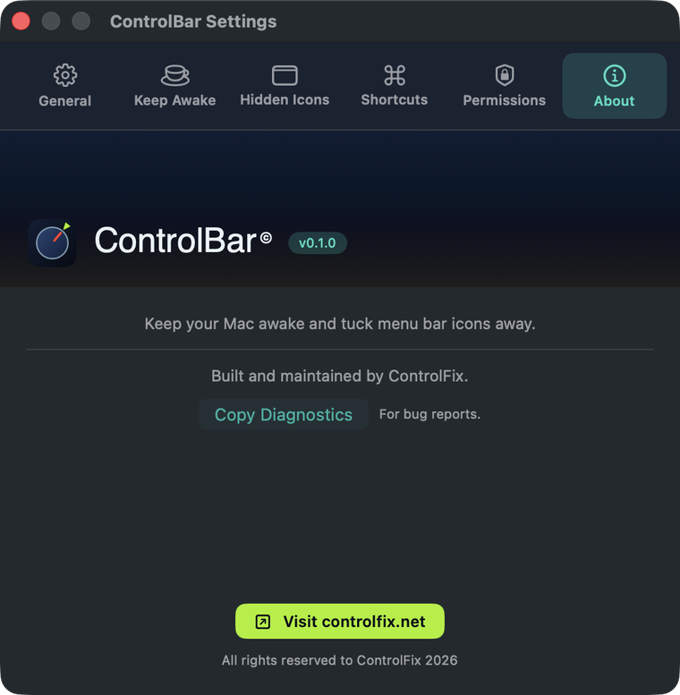

# ControlBar

A small macOS menu bar app that does two things:

1. **Keep awake.** It stops your Mac from idle-sleeping, like Caffeine or `caffeinate`: indefinitely or for 15 min to 8 h, with or without keeping the display on.
2. **Hidden icons strip.** It hides the menu bar icons you don't need all the time. One click (or a shortcut) shows them in a strip just below the menu bar. The strip hides itself after a delay (7 s by default), when you click outside it, or when you press Esc.



Requires macOS 14 Sonoma or later (tested on macOS 26 Tahoe). Downloads for Apple Silicon and Intel are on the ControlFix site: <https://controlfix.net/projects/mac-apps>. The app is not notarized yet, so on first launch right-click it and choose **Open**.

## Screenshots

| | |
|---|---|
|  |  |
| The menu, with its shortcuts | Settings → Keep Awake |
|  |  |
| Settings → Hidden Icons | Settings → Shortcuts |
|  | |
| Settings → About | |

## Using it

| Icon | Click | Right-click |
|---|---|---|
| ☕ coffee bean | Toggle keep-awake | The ControlBar menu |
| ◔ dial | Show the hidden-icons strip | The ControlBar menu (⌥-click: arrange icons) |
| ┃ divider | The ControlBar menu | The ControlBar menu |

The ┃ divider is only in the menu bar while the strip is open or while you are arranging icons. It can be ⌘-dragged only while arranging: click the ┃ while the strip is open (or choose *Arrange Menu Bar Icons…*) to start.

- **Choosing what to hide:** choose *Arrange Menu Bar Icons…*, then hold **⌘** and drag icons to the left of the ┃ divider to hide them, or to its right to keep them visible. Click ✓ when you're done.
- **Moving a hidden icon back to the menu bar:** hold **⌘** and drag it from the strip onto the menu bar, to the right of the ┃ divider. ControlBar reveals the hidden section, ⌘-drags the real icon to where you let go, and hides the rest again. An icon that sits behind the notch while the section is revealed can't be grabbed this way; ControlBar tells you when that happens.
- **Opening a hidden icon:** click it in the strip. ControlBar briefly reveals the real icon and presses it, so its menu opens where it normally would. Right-click an icon in the strip to send it a right-click.
- **Keep awake:** turn it on from the coffee-bean icon or the menu. *Keep Awake For* offers Indefinitely, 15 / 30 minutes, and 1 / 2 / 4 / 8 hours; the default time, *Keep screen on* and *Turn on at launch* are in Settings → Keep Awake.
- **Settings:** General (launch at login, which icons to show, brand colours), Keep Awake, Hidden Icons (hide delay, icon size, hide on outside click, hover pause), Shortcuts, Permissions and About (with *Copy Diagnostics* for bug reports).

### Shortcuts

Menu shortcuts work while the ControlBar menu is open and can be re-assigned in Settings → Shortcuts. Show hidden icons is a global hotkey (change it in Settings → General).

| Action | Default |
|---|---|
| Turn keep awake on/off | ⌘K |
| Keep awake for… | ⌘D |
| Keep screen on | ⇧⌘D |
| Arrange icons | ⌘A |
| Settings | ⌘, |
| About | ⌘I |
| Quit | ⌘Q |
| Show hidden icons (global) | ⌃⌥⌘H |

On first launch ControlBar puts its icons at the right end of the menu bar, so on a crowded MacBook they aren't stuck behind the notch. Every other icon starts out hidden; drag your favourites back to the right of the divider. The *Permissions…* item in the menu appears only while a permission is still missing.

## Permissions

| Permission | Why |
|---|---|
| **Accessibility** | Find hidden menu bar icons, read their positions and press them. |
| **Screen Recording** | Capture pictures of the hidden icons for the strip. Without it, the strip shows each app's icon instead. |

ControlBar never records your screen. It only captures the small menu bar icons it shows. Keep-awake needs no permissions. Bundle identifier: `com.controlfix.bar`.

## Building

```bash
scripts/make-signing-cert.sh   # once: creates a local self-signed code-signing identity
scripts/build.sh               # builds build/ControlBar.app
open build/ControlBar.app
```

`make-signing-cert.sh` is optional, but without it every rebuild is signed ad-hoc and macOS forgets the permissions you granted. Use `UNIVERSAL=1 scripts/build.sh` for an arm64 + x86_64 build, or `ARCH=arm64` / `ARCH=x86_64` for a single architecture. `swift scripts/make-icon.swift` regenerates the app icon.

Troubleshooting: *Settings → About → Copy Diagnostics* produces a report of what ControlBar sees in the menu bar. You can also run `open build/ControlBar.app --args --diagnose /tmp/controlbar-diag`, which writes `report.txt` plus the captured icon images to that folder and then quits.

## How it works

- **Keep awake:** an IOKit power assertion (`PreventUserIdleSystemSleep` or `PreventUserIdleDisplaySleep`). The system releases it automatically if ControlBar quits.
- **Hiding:** ControlBar adds a divider status item, the only item that hides anything. To hide, the divider grows very wide, which pushes every icon on its left off the screen. To reveal, it shrinks back. While the strip is open, a small click-through overlay draws the ┃ at the boundary, because the stretched divider's own glyph is off-screen.
- **Moving icons:** macOS has no API for rearranging other apps' status items, so ControlBar posts a real ⌘-drag (synthetic mouse events) on the revealed icon.
- **Finding hidden icons:** each app's status items are read through the Accessibility API (`AXExtrasMenuBar`), which gives the owner, label, position and a pressable element. On macOS 26 every status-item window is owned by Control Center, so the window list alone can't tell which app an icon belongs to.
- **Pictures:** the icon's window is matched by position and captured with ScreenCaptureKit. Single-colour glyphs are drawn as templates so they stay readable on the strip's background.
- **Clicking:** the hidden section is revealed briefly, the item gets an `AXPress` (with a synthetic click as a fallback), and ControlBar waits until the menu or popover closes before hiding again.

Source layout:

```
Sources/ControlBar/
├── App/          entry point, app delegate, diagnostics
├── KeepAwake/    power assertion + durations
├── MenuBar/      status items, Accessibility scanner, image capture, click forwarding
├── Strip/        the floating strip panel and its auto-hide logic
├── Settings/     SwiftUI settings window
└── Support/      preferences, global hotkey, permissions, small helpers
```

## Known limitations

- While you use an icon from the strip, the hidden section is briefly shown in the menu bar.
- Apps that redraw their icon constantly (clocks, CPU meters) are shown as they looked at the moment of capture.
- Keep-awake prevents *idle* sleep. Closing a laptop's lid still sleeps it unless an external display is connected.

## License

Copyright (c) 2026 ControlFix. All rights reserved, see [LICENSE](LICENSE).
